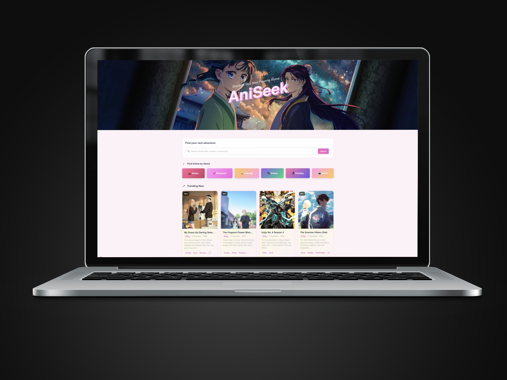
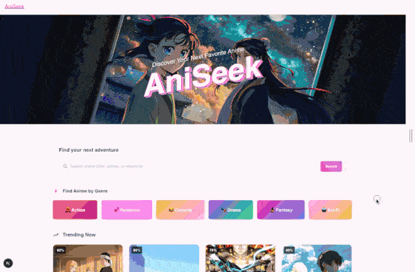

# AniSeek



Discover your new favorite anime

## Getting Started

### Prerequisites

Make sure you have Node.js v20 installed on your machine.

### Development Setup

1. **Clone the repository:**

   ```bash
   git clone https://github.com/JanineAmelie/aniseek.git
   cd aniseek
   ```

2. **Install dependencies:**

   ```bash
   npm install
   ```

3. **Generate GraphQL types:**

   ```bash
   npm run codegen
   ```

4. **Run the development server:**

   ```bash
   npm run start
   ```

5. **Open your browser:**
   Open [http://localhost:3000](http://localhost:3000) with your browser to see the result.

### Important Notes

- **Always run codegen after cloning** - The GraphQL generated files are not committed to the repository
- **Run codegen after schema changes** - If you modify GraphQL queries or the schema, regenerate the types



### Personal Notes

#### Project Background

I was tasked with creating a web app of my choice that retrieves data from any API or GraphQL endpoint. I chose the AniLIST API because it's one of the most popular and actively developed anime databases that is still up and very generous with its rate limits. As an anime fan, I found this project both enjoyable and engaging, allowing me to build a colorful and fun app.

#### Technical Decisions & Trade-offs

If time permitted, I would have implemented a fully server-side rendered app and explored even more features that Next.js had to offer with Rehydration and Streaming, but I focused on delivering a solid MVP foundation within the available timeframe.

To be honest, I have limited experience with SSR since most of the big clients I've worked with don't prioritize it - they're usually content with client-side rendering and moving fast to ship features. The focus is always on getting MVPs out the door quickly rather than investing time in proper SSR setup, even though the performance and SEO benefits are obvious. It's one of those things that gets pushed to 'phase 2' and never actually happens because stakeholders see it as technical debt rather than user value. I'd definitely love to explore and learn more about it if I had more time. I believe a complete app is better than an incomplete toy project.

#### Technology Stack

For this project I utilized the following technologies:

- **Next.js** - for a solid boilerplate and React foundation
- **TypeScript** - of course my baby, essential for type safety
- **Apollo GraphQL & Codegen** - handled API calls with auto-generated types and hooks
- **Material-UI & Styled Components** - for a clean, responsive UI with custom styling
- **ESLint, Prettier, sanitize-html** - keeping code clean and content secure

#### Testing Approach

I've implemented comprehensive unit tests for `src/utils/formatYear.test.ts` as a demonstration of my testing methodology and approach to quality assurance. While ideally every utility function would have complete test coverage, I focused on delivering one thoroughly tested example within the project timeframe that showcases how I structure and write tests.

**Running the tests:**

```bash
npm test
```

The test suite covers:

- **Edge cases** - handling null, undefined, and zero values
- **Realistic scenarios** - based on actual anime data patterns
- **Error conditions** - ensuring graceful handling of invalid data
- **Business logic** - validating year formatting rules and display logic

This focused approach hopefully gives you a clear picture of my testing standards and how I think about quality assurance in real-world development scenarios.

#### Development Experience

I had a blast building this project over the weekend and completely lost track of time because I was genuinely enjoying creating something from scratch. It's rare as developers that we get to start fresh and build something entirely our own... We're usually stuck writing features for massive existing codebases that someone else set up ages ago. There's something incredibly refreshing about having full creative control and being able to make every architectural decision yourself.

It had been 5 years since I last played with GraphQL and CodeGen, and I absolutely loved diving back into it. It was SO refreshing to have 100% control over my data with no need to fuss over data normalization, plus having complete confidence in my type safety while building. Creating this app reminded me why I fell in love with GraphQL in the first place - the developer experience is just unmatched.

#### Fun Discovery

Funnily enough, I discovered a new anime I wanted to watch as a result of testing the trending API calls!

#### Future Vision

If I wanted to make this more useful, I'd love to hook it up to an API like "Just Watch" so I could immediately find out if the anime is available on my preferred streaming platforms. That would turn it from a fun discovery tool into something I'd actually use daily to decide what to watch next.

## Future Enhancements

If time permitted, I would have loved to explore the following

- **Server-Side Rendering** with Next.js App Router for improved SEO and initial load times
- **Incremental Static Regeneration** for popular anime pages
- **Advanced Caching** strategies with Apollo Client and HTTP caching
- **Progressive Web App** features for offline browsing and mobile app-like experience
- **Streaming Platform Integration** (Just Watch API) to show where anime is available to watch
- **Internationalization** I made a start in my text.ts file out
